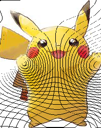
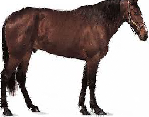

# Assignment 1 - Image Warping

### Implement basic transformation and point-based deformation for images.

## Requirements
To install requirements:
```
 python -m pip install -r requirements.txt
```

## Running
To run basic transformation, run:
```
python run_global_transform.py
```

To run point guided transformation, run:
```
 python run_point_transform.py
```
## Results







## Acknowledgement
- [Image Deformation Using Moving Least Squares](https://people.engr.tamu.edu/schaefer/research/mls.pdf)
- [Image Warping by Radial Basis Functions : Application to Facial Expressions](https://www.sci.utah.edu/~gerig/CS6640-F2010/Project3/Arad-1995.pdf)
- [Opencv: Geometric Transformations of Images](https://docs.opencv.org/4.x/da/d6e/tutorial_py_geometric_transformations.html)
- [CSDN经典论文回顾：Image Deformation Using Moving Least Squares](https://blog.csdn.net/u011426016/article/details/125243631)
- [知乎专栏](https://zhuanlan.zhihu.com/p/103212151)
