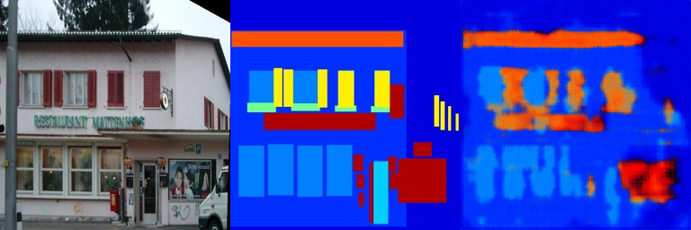
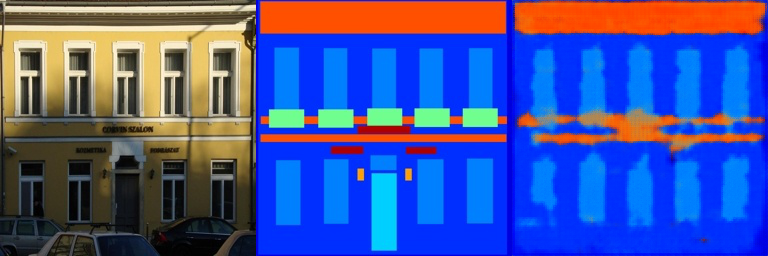
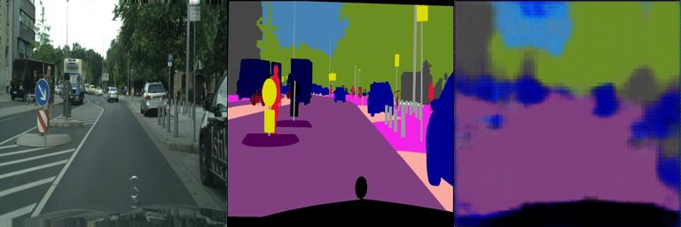
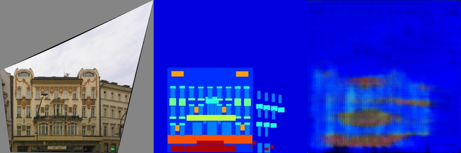
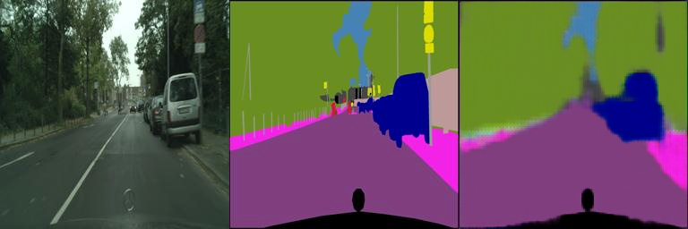
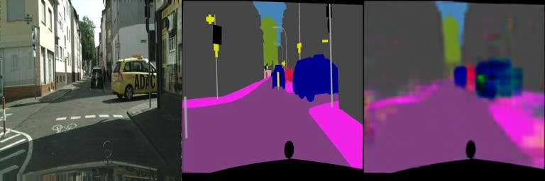
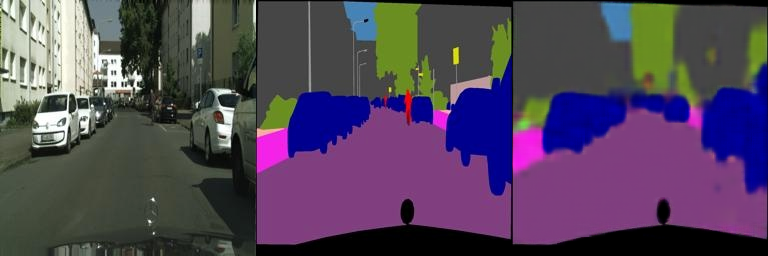
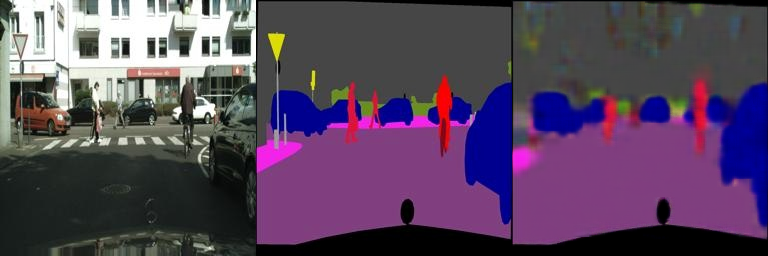
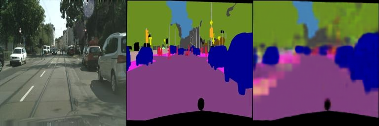
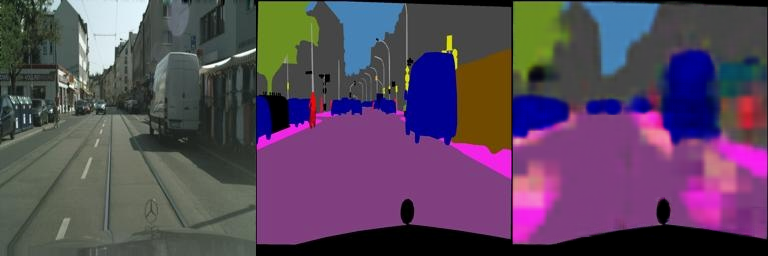

# 实验报告

## 1. 实验名称
实验名称：**[Poisson编辑与图像的语义分割]**

## 2.简单介绍
本次实验的主要目的是通过实验，熟悉和掌握pytorch框架。实验主要任务：一是学会使用torch里面的优化算法完成对图像的poisson编辑。二是利用torch搭建fully convolutional network完成对图像的语义分割。

## 3. 实验结果

以下分别展现两个结果的对比。
- 结果一：
  
- 结果二：
  - 对于数据集下载，为了适配windows系统，写了一个脚本，将数据集下载到本地，然后解压到指定目录。

  对使用网络的说明：一是自己写的神经网络：包含4个卷积层(conv1-conv4)，每层都包含：卷积、批归一化、ReLU激活。特征在网络中通道数逐渐增加：3->8->16->32->64，之后使用stride=2进行下采样，特征图尺寸逐渐减小。解码器(Decoder)部分：包含4个反卷积层(deconv1-deconv4)。除最后一层外，每层都包含：反卷积、批归一化、ReLU激活，通道数逐渐减少：64->32->16->8->3，最后一层使用Tanh激活函数，将输出范围限制在[-1,1]。
  对于训练过程，100轮训练val_error大概是0.12左右；二是实现了论文里给的架构。在FCN_network.py中作为类出现并在main函数里调用。主要操作是提取VGG16的特征提取部分，后面将全连接层转换成卷积层。
  从实验结果来看，原来的简单神经网络对loss的处理较慢，训练集上loss400轮在0.20左右下降缓慢。增加了新数据集之后，一轮epoch要完成34step左右的训练，Loss下降显著，在40轮左右下降至0.17，训练速度有很大提升。最后采用论文的框架在新数据集上进行训练，在二十轮训练左右便能降到0.098左右,从下面的结果中也可以看到，论文里的架构在训练过程中，loss下降的更快，segmentation的效果也更好。

  ### 普通卷积神经网络：
  
  - 在第一个数据集上训练，loss接近0.2，epoch约为400时结果：
  
  

  - 在增广数据集上训练，loss接近0.18，epoch约为40时达到:
  
  
  
  

  ### 论文里给的架构:
  
  
  
  
  
